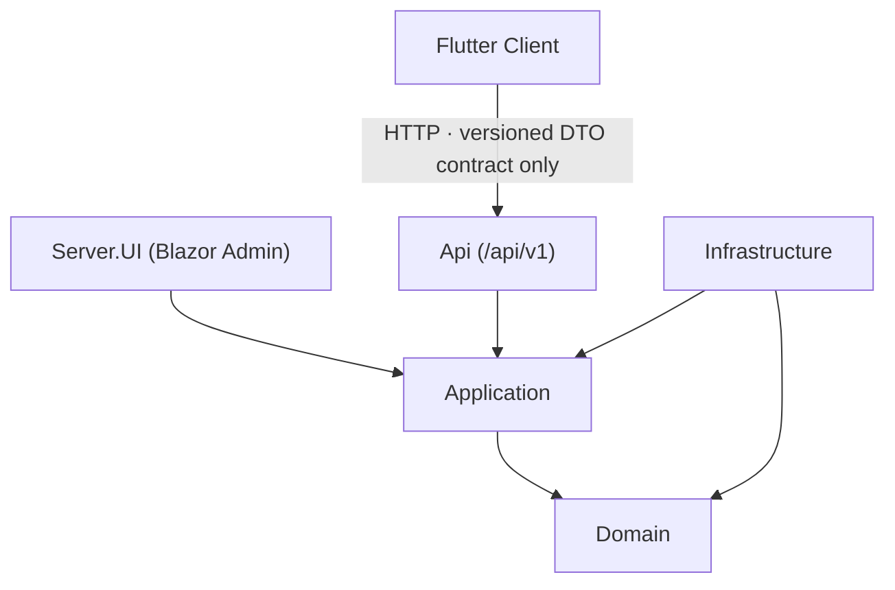
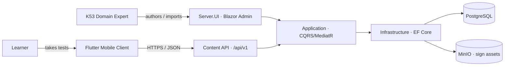
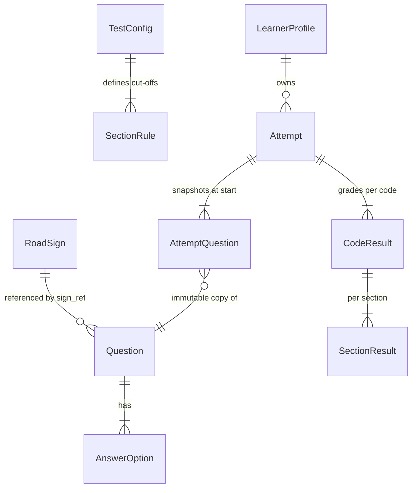

# Architecture Spine — K53 Guru

Two-sided system: an admin-authored content backend and a learner-facing mobile client. The backend already exists as a .NET 10 Clean Architecture Blazor template; this spine **ratifies** those conventions and fixes only the net-new invariants — the content API boundary, server-side test fidelity, and the anonymous learner model — that keep the Admin Panel, the API, and the Flutter app from diverging.

## Design Paradigm

**Backend — Clean Architecture + CQRS (MediatR).** Already established; ratified, not re-derived. Concentric layers, dependencies point inward:

- `Domain` — entities, enums, value objects, domain events. No outward dependencies.
- `Application` — CQRS use cases (MediatR commands/queries), validators, pipeline behaviours, specifications, DTOs. **All business logic lives here** — test composition, scoring, import validation.
- `Infrastructure` — EF Core persistence, seeding, external services (object store, mail). Implements Application interfaces.
- `Server.UI` — the Blazor Server Admin Panel (authoring, import, publish).
- `Api` *(new)* — ASP.NET Core controllers that serve the Flutter client, delegating to the same Application handlers.

**Client — layered Flutter app.** `presentation` (screens/widgets) → `state` (Riverpod) → `data` (repositories + typed API client + DTO models) → client-side `domain` value types. A separate bounded context that depends **only** on the API's versioned DTO contract.



## Invariants & Rules

### AD-1 — Clean Architecture + CQRS layering [ADOPTED]

- **Binds:** all backend code
- **Prevents:** business logic scattering into UI/controllers; outward domain dependencies
- **Rule:** Dependencies point inward (`Domain ← Application ← {Infrastructure, Server.UI, Api}`). Every use case is a MediatR command/query in `Application/Features/**`; controllers and Blazor pages contain no business logic. DB access uses `IApplicationDbContextFactory` per-operation contexts (`await using`), never a shared injected `DbContext`.

### AD-2 — Client is API-only; content is never bundled

- **Binds:** CAP-1..9 (client side)
- **Prevents:** the app embedding a stale content copy; client and backend diverging on the source of truth
- **Rule:** The Flutter client obtains all tests, questions, signs, and results exclusively over the backend HTTP API. It ships no test content and never accesses the database, Blazor, or domain types directly.

### AD-3 — Content API delegates to the shared Application layer

- **Binds:** CAP-1, CAP-4, CAP-5, CAP-6
- **Prevents:** Admin-preview and API-delivery computing composition or scoring on two divergent code paths
- **Rule:** The learner API is ASP.NET Core controllers under `/api/v1/**` that call the **same** `Application` MediatR handlers the Admin Panel uses. Controllers do mapping and HTTP concerns only — zero composition/scoring logic.

### AD-4 — Fidelity is computed server-side only

- **Binds:** CAP-4, CAP-5, CAP-6, CAP-8
- **Prevents:** client and server disagreeing on outcome; fidelity rules drifting between platforms
- **Rule:** Test composition (per-attempt randomisation, section assembly, combination handling) and scoring (per-section cut-offs, per-code independent grading, partial pass) are computed in `Domain`/`Application`. The client renders questions, collects answers, and displays server results **verbatim** — it never selects, orders, grades, re-computes, re-validates, or caches a pass/fail. A results DTO is authoritative even if it looks inconsistent (that is a server bug to log, never a client-side override).

### AD-5 — An Attempt is an immutable snapshot

- **Binds:** CAP-4, CAP-6
- **Prevents:** a live attempt changing under the learner; two attempts sharing mutable question references; client and server disagreeing on question order across a resume
- **Rule:** Starting an attempt snapshots its full question set (questions, options, correct keys, section structure) into owned, immutable `AttemptQuestion` records. The server assigns each record an immutable per-section `display_order` at snapshot time (intra-section randomisation happens here, server-side, per AD-9). The API returns records in `display_order`; the client renders that order as-received and **never re-shuffles**. A resume returns the identical order. Admin content edits apply only to attempts started afterward and never mutate an in-flight attempt.

### AD-6 — Correct answers are confidential in Test mode

- **Binds:** CAP-6, CAP-8
- **Prevents:** answer leakage to a cold simulation; client-side grading; a cached Practice grade diverging from the server
- **Rule:** In **Test mode** the API returns questions **without** correct keys or explanations; the client submits responses and the server returns only per-section/per-code results. **Practice mode** may return correctness and explanation inline, but correctness is still **computed and owned by the server** — the client never derives or caches an `is_correct` or a score, and re-queries the server rather than trusting a stale local result. Grading always happens server-side (see AD-4).

### AD-7 — Road signs are seeded reference data addressed by legislation code

- **Binds:** CAP-3, CAP-7
- **Prevents:** orphaned sign references; ad-hoc labels; duplicate sign sources; an ambiguous `sign_ref` resolving to different signs
- **Rule:** The road-sign catalog is foundational seed data (each sign carrying its official legislative code) loaded via the Infrastructure initializer. `legislation_code` is a **unique key** — each `sign_ref` appears exactly once (seeding fails fast on a duplicate). Questions reference a sign by `sign_ref` — never an embedded image or ad-hoc label. Resolution is **exactly-one** (`SingleOrDefault`, never `First`); a `sign_ref` that does not resolve, or resolves ambiguously, is rejected at author/import time.

### AD-8 — Import validates every row before persistence, all-or-nothing per row

- **Binds:** CAP-2, CAP-7
- **Prevents:** any broken question ever reaching a learner; partial/corrupt imports
- **Rule:** CSV/JSON import validates each row against the question schema **and** the sign catalog before storing it. A row with a missing required field or unresolved `sign_ref` is rejected with the offending row identified; it is never partially stored. Reuses the existing import-command / `IExcelService` pattern.

### AD-9 — Two-axis content model; fixed section order; intra-section randomisation

- **Binds:** CAP-5, CAP-6
- **Prevents:** mis-composed sittings; shared sections duplicated in a combination
- **Rule:** Every question carries two independent axes — applicable code(s) in `{Code1, Code2, Code3}` and a class of `shared` (Rules of the Road, Road Signs) or `code-specific` (Vehicle Controls) — plus a `language_code` (default `en`; v1 seeds English only, see Deferred). Section order is fixed **Rules → Signs → Controls**; randomisation is **intra-section only**. A combination sitting (Code 1+2 or Code 1+3) answers the shared sections once and adds one Vehicle-Controls module per selected code.

### AD-10 — Learner identity is a self-custodied anonymous UUID

- **Binds:** CAP-9
- **Prevents:** learner identity leaking into the ASP.NET Identity system; any PII collection
- **Rule:** A learner is identified by a client-generated UUIDv4 sent as an opaque key on API calls — no account, password, or PII, and **not** ASP.NET Identity (which stays the Admin auth domain). Profile data is keyed solely by the UUID; losing it loses access. The API rate-limits UUID-keyed endpoints to deter enumeration.

### AD-11 — Fidelity parameters are configurable data, not code

- **Binds:** CAP-6
- **Prevents:** hardcoded fidelity logic; Admin/API divergence when tuning; timing disputes between client and server
- **Rule:** Per-code question counts, pass marks, time limits, and section definitions are stored as configuration entities (seeded from `test-structure.md`), read by the composition/scoring logic. No fidelity threshold is a code literal. **The server clock is the authoritative timing source**: elapsed time is computed server-side from `attempt.started_at`; a submission may carry a client `submitted_at` for diagnostics only, never for the deadline check. The client may run a local countdown and auto-submit, but accepts server rejection of a late submission. Defaults are provisional pending confirmation against a live DLTC/CLLT terminal.

### AD-12 — API speaks versioned DTOs, never internal types

- **Binds:** CAP-1..9 (API surface)
- **Prevents:** the client coupling to the internal schema; silent breaking changes
- **Rule:** API responses use explicit DTOs; EF entities and domain events are never serialized to the client. A breaking contract change bumps the `/api/vN` segment. Enums serialize as strings; errors use `ProblemDetails`.

### AD-13 — Two authorization domains

- **Binds:** CAP-1, CAP-9
- **Prevents:** draft content leaking to learners; unauthenticated writes to admin content
- **Rule:** The Admin Panel (author/import/publish) uses the existing ASP.NET Identity + roles. The learner API serves **only published** content anonymously (read) and accepts attempt submissions keyed by the learner UUID. The working default is "an authenticated admin can author/publish"; the finer author-vs-publish-vs-import role split is settled in the Admin epic.

### AD-14 — Operational envelope

- **Binds:** CAP-1..9 (runtime)
- **Prevents:** deployment/environment/schema-migration decisions falling through the cracks or being made incompatibly per epic
- **Rule:** The backend runs containerized via the existing `docker-compose`; **PostgreSQL** is the production DB provider (`Migrators.PostgreSQL`). Schema changes ship as version-controlled EF Core migrations applied through the provider-specific Migrator project — never `EnsureCreated` or ad-hoc SQL in production. Environments are configuration-driven via `IOptions<T>`/`appsettings.{Environment}.json`; no environment-specific literals in code. The learner API is a public internet surface: HTTPS only, `ProblemDetails` errors, and per-UUID rate limiting (working default a modest sliding window; exact thresholds deferred to the security epic). The Flutter client is distributed via the app stores and pinned to a compatible `/api/vN`. Sign assets are served from the object store (MinIO).

## Consistency Conventions

| Concern | Convention |
| --- | --- |
| Naming (backend) | PascalCase types; `I`-prefixed interfaces; entities derive `BaseAuditableEntity`; CQRS types `*Command` / `*Query`; DTOs `*Dto`; options `*Settings`/`*Options` |
| Naming (Flutter) | snake_case file names; PascalCase Dart classes; DTOs mirror API `*Dto` names; providers `*Provider`, repositories `*Repository` |
| Data & formats | IDs are GUIDs; timestamps UTC ISO-8601; `sign_ref` is the official legislation-code string; enums serialize as strings; API errors as `ProblemDetails`; responses are versioned DTOs |
| State & mutation | Writes only via MediatR commands through `IApplicationDbContextFactory` per-op contexts; reads via Ardalis.Specification; cache via FusionCache pipeline with tag invalidation |
| Cross-cutting | Logging via Serilog; config via strongly-typed `IOptions<T>`; validation via FluentValidation behaviours; admin auth = ASP.NET Identity, learner API = anonymous + UUID key |
| Client access | Widgets never call HTTP; all backend access flows through the `data` repository layer against the DTO contract |

## Stack

| Name | Version |
| --- | --- |
| .NET | net10.0 *(existing target; packages on 10.0.0-rc.2 — see Deferred)* |
| ASP.NET Core | 10.x |
| EF Core (+ Npgsql provider) | 10.x |
| MediatR · FluentValidation · FusionCache · Ardalis.Specification · AutoMapper · Serilog · MudBlazor | as pinned in the existing solution |
| PostgreSQL (production DB) | 16+ |
| MinIO (sign-image / static assets) | existing template pin |
| Flutter | 3.47.2 (stable, verified 2026-08-27) |
| Dart | 3.13.2 |
| Riverpod (client state) | 3.x (pin at client-epic kickoff) |

## Structural Seed

**Container view.**



**Core entities** (names + relationships only; attribute-level detail is owned by the code).



**Source tree** (scaffold, not a mirror — the code owns the detail).

```text
src/K53Guru/src/
  Domain/Entities/        # RoadSign, Question, AnswerOption, Attempt, AttemptQuestion, LearnerProfile, TestConfig
  Application/Features/
    RoadSigns/            # catalog queries
    Questions/            # author + import commands, schema/sign validation
    Tests/                # per-attempt randomised composition
    Attempts/             # start (snapshot), submit, grade
    Profiles/             # UUID profile create/restore
  Infrastructure/Persistence/   # EF configs, sign-catalog seed, migrations
  Server.UI/              # Blazor Admin Panel (authoring, import, publish)
  Api/                    # NEW — ASP.NET Core controllers /api/v1, versioned DTOs
k53_guru_app/             # NEW — Flutter client
  lib/
    presentation/         # screens, widgets
    state/                # Riverpod providers
    data/                 # repositories, API client, DTO models
    domain/               # client value types (LicenceCode, SectionType)
```

## Capability → Architecture Map

| Capability | Lives in | Governed by |
| --- | --- | --- |
| CAP-1 authoring | Server.UI + Application/Features/Questions | AD-1, AD-3, AD-13 |
| CAP-2 CSV/JSON import | Application/Features/Questions (import) | AD-8, AD-7 |
| CAP-3 sign catalog | Infrastructure seed + Domain RoadSign | AD-7 |
| CAP-4 randomised delivery | Application/Features/Tests + Api | AD-3, AD-4, AD-5 |
| CAP-5 single/combination sittings | Application/Features/Tests | AD-9, AD-4 |
| CAP-6 faithful scoring | Application/Features/Attempts | AD-4, AD-5, AD-6, AD-11 |
| CAP-7 import validation | Application/Features/Questions | AD-8, AD-7 |
| CAP-8 Practice vs Test mode | Api + Application/Features/Attempts | AD-6, AD-4 |
| CAP-9 anonymous UUID identity | Application/Features/Profiles + Api | AD-10, AD-13 |

## Deferred

- **Per-epic detail** — entity attribute schemas, individual endpoint shapes, DTO field lists, Riverpod provider graph, and widget structure belong to the epic/story spines below this one.
- **Stable-package upgrade** — the solution targets `net10.0` but pins Microsoft packages at `10.0.0-rc.2`; moving to stable `10.0.x` is a self-contained bump, safely done independently of feature work. Do before production.
- **Offline test-taking** — SPEC open question; v1 is online-first (see assumptions). Revisit if offline sittings become a requirement; would add a client-side attempt store and sync boundary.
- **Multi-language content** — v1 is English-only; the content model keeps a language axis open. Revisit if Afrikaans/other official languages are required.
- **Admin role/permission model** — SPEC open question (AD-13); exact roles for author vs publish vs import deferred to the Admin epic.
- **Content copyright/licensing** — legal status of reproducing official question-bank content is unresolved; working assumption is original expert-authored content. Not an architecture decision, but gates content population.
- **Time-limit enforcement** — depends on confirming official CLLT limits (test-structure.md, low confidence); AD-11 makes it configurable so the value can land late without structural change.
